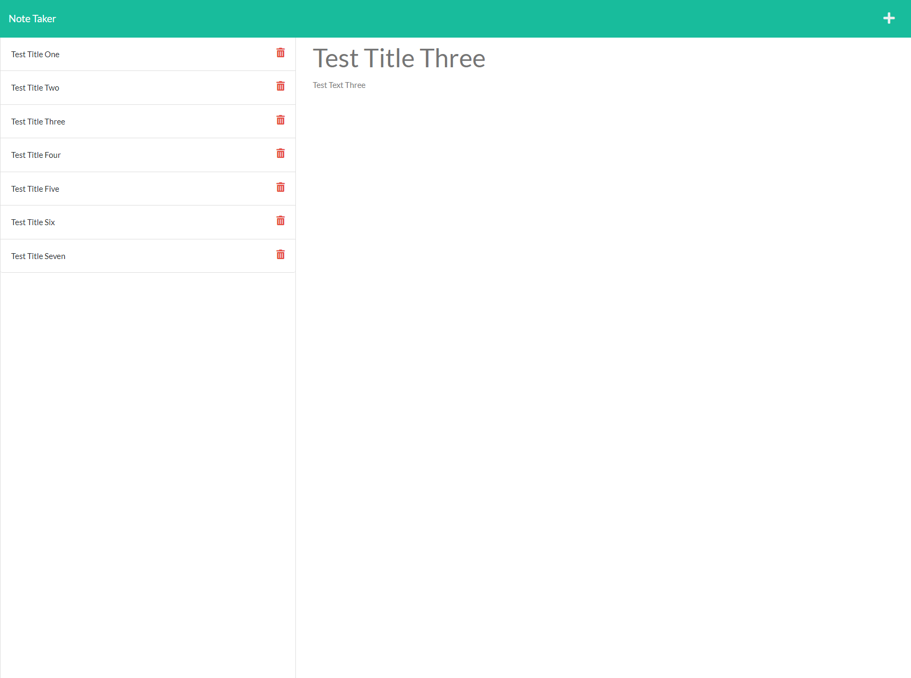

# Harabushi's Note Takerizer

## Description

 
This app lets you create, store, and delete personal notes to help keep you organized throughout your work-day.
 
 

## Table of Contents

- [Installation](#installation)
- [Usage](#usage)
- [Credits](#credits)
- [License](#license)

## Installation

This app is available at https://lit-lake-90884.herokuapp.com/

 
 

## Usage

Press the "Get Started" button, and then start keeping track of your notes!
 
 

## License

Licensed under the [MIT](https://opensource.org/licenses/MIT) license.

 
 

## Contributing

No current contribution guidelines
 
 

## Tests

no current test information
 
 

## Questions

If you have any questions about this project please reach out either through GitHub or my email. 
Please include the name of the project in the subject line and any other relevant information in the content. 

[github.com/Harabushi](https://github.com/Harabushi) 
[Harabushi.coding@gmail.com](mailto:Harabushi.coding@gmail.com)
 
 

### Credits

Me, the module, the class
